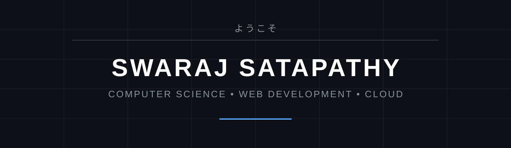

<p align="center">
  
</p>

<h1 align="center">Swaraj Satapathy</h1>

<p align="center">
  <b>Computer Science Undergraduate • Web Developer • Cloud & AWS</b>
</p>

<p align="center">
  Building practical web applications, exploring scalable systems,
  and continuously improving as a software engineer.
</p>

<p align="center">
  <a href="https://www.linkedin.com/in/swaraj-satapathy-b97790337/">
    
  </a>

  <a href="mailto:swarajsatapathy.rkl@gmail.com">
    
  </a>
</p>

---

## About Me

```text
Name        : Swaraj Satapathy
Role        : Computer Science Undergraduate
Focus       : Web Development & Cloud
Location    : Odisha, India
```

I enjoy building applications that solve practical problems while learning how modern web applications are designed, deployed and scaled.

### Currently focusing on

- Full-stack web development
- Modern frontend architecture
- Next.js and React
- Node.js and Express
- REST APIs
- Cloud infrastructure
- AWS
- Data Structures & Algorithms
- Improving system design fundamentals

---

## Tech Stack

### Languages

<p>
  
</p>

### Frontend

<p>
  
</p>

### Backend

<p>
  
</p>

### Databases

<p>
  
</p>

### Cloud & DevOps

<p>
  
</p>

---

## Featured Projects

<table>
  <tr>
    <td width="33%" valign="top">

<h3 align="center">Political Khati</h3>

<p>
A modern digital news platform for publishing web news and video news with a complete administration system.
</p>

<p><strong>Tech Stack</strong></p>

<p>
<code>Next.js</code>
<code>TypeScript</code>
<code>Node.js</code>
<code>MongoDB</code>
<code>AWS</code>
</p>

<p align="center">
<a href="https://github.com/Swarajsatapathy/Political-Khati">
<b>View Repository →</b>
</a>
</p>

</td>

<td width="33%" valign="top">

<h3 align="center">Odisha Digital Media Mahasangha</h3>

<p>
A digital media organization platform with member management, news publishing, gallery, ID cards and administration tools.
</p>

<p><strong>Tech Stack</strong></p>

<p>
<code>Next.js</code>
<code>Node.js</code>
<code>MongoDB</code>
<code>AWS</code>
</p>

<p align="center">
<a href="https://github.com/Swarajsatapathy/MediaMahasangha">
<b>View Repository →</b>
</a>
</p>

</td>

<td width="33%" valign="top">

<h3 align="center">Srishti News</h3>

<p>
A full-stack digital news platform with article publishing, video news, reporter management and cloud infrastructure.
</p>

<p><strong>Tech Stack</strong></p>

<p>
<code>Next.js</code>
<code>TypeScript</code>
<code>MongoDB</code>
<code>AWS</code>
</p>

<p align="center">
<a href="https://github.com/Swarajsatapathy/srishti">
<b>View Repository →</b>
</a>
</p>

</td>
  </tr>
</table>

---

## Activity

<p align="center">
  

  
</p>

<br>

<p align="center">
  
</p>

<br>

<p align="center">
  
</p>

---

## Engineering Interests

```text
Web Development       ███████████████████░
Cloud & AWS           █████████████████░░░
Backend Development   ████████████████░░░░
System Design         ███████████░░░░░░░░░
DSA                   █████████████░░░░░░░
```

I am particularly interested in understanding how applications move from an idea to a production system — frontend, backend, databases, deployment and cloud infrastructure.

---

## Beyond Code

When I'm not working on projects, I'm usually:

- Exploring new technologies
- Improving my problem-solving skills
- Learning more about cloud infrastructure
- Experimenting with new project ideas
- Improving existing projects instead of leaving them unfinished

---

## Connect With Me

<p align="center">

  <a href="https://github.com/Swarajsatapathy">
    
  </a>

  <a href="https://www.linkedin.com/in/swaraj-satapathy-b97790337/">
    
  </a>

  <a href="mailto:swarajsatapathy.rkl@gmail.com">
    
  </a>

</p>

<br>

<p align="center">
  <i>Build • Learn • Improve • Repeat</i>
</p>